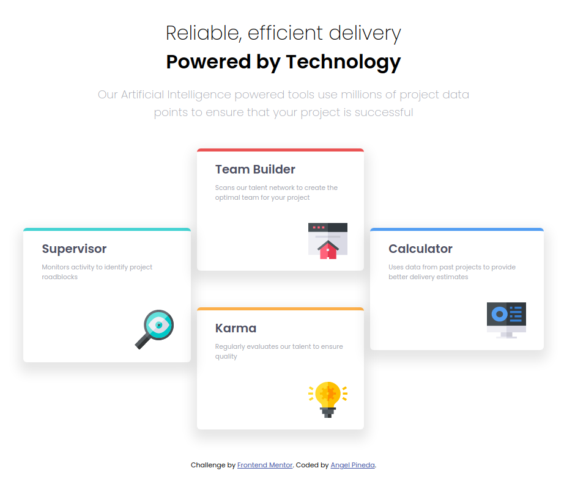

# Frontend Mentor - Four card feature section solution

This is a solution to the [Four card feature section challenge on Frontend Mentor](https://www.frontendmentor.io/challenges/four-card-feature-section-weK1eFYK). Frontend Mentor challenges help you improve your coding skills by building realistic projects. 

## Table of contents

- [Overview](#overview)
  - [The challenge](#the-challenge)
  - [Screenshot](#screenshot)
  - [Links](#links)
- [My process](#my-process)
  - [Built with](#built-with)
  - [What I learned](#what-i-learned)
  - [Continued development](#continued-development)
  - [Resources](#resources)
- [Author](#author)

## Overview

### The challenge

Users should be able to:

- View the optimal layout for the site depending on their device's screen size

### Screenshot

This is a preview about the desktop design.

### Links

- Solution URL: [Visit](https://www.frontendmentor.io/solutions/four-card-feature-0KWfHNnHh)
- Live Site URL: [Visit](https://aocelopilli.github.io/frontendMentor-fourCardFeature/)

## My process

### Built with

- Semantic HTML5 markup
- CSS custom properties
- Flexbox
- CSS Grid
- Mobile-first workflow

### What I learned

Use better the grid layout, it did easy to make up this challenge.

### Continued development

Keep practicing with grid css layout and flexible box.

### Resources

[Grid Css - Css tricks](https://css-tricks.com/snippets/css/complete-guide-grid/)

## Author

+ Website - [www.angelpineda.com.mx](https://www.angelpineda.com.mx)
+ Frontend Mentor - [@angelp495](https://www.frontendmentor.io/profile/angelp495)
+ Twitter - [@AOcelopilli](https://twitter.com/AOcelopilli)